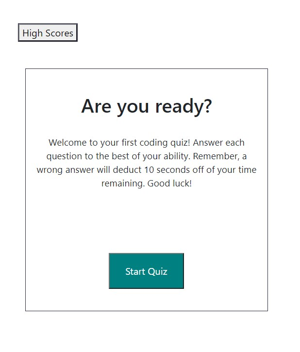
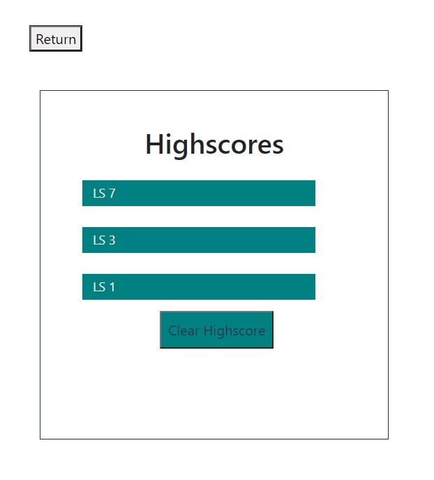

# Loreina Salalila - Code Quiz
  
  ## Description
 Build a timed code quiz with multiple-choice questions. This app will run in the browser and feature dynamically updated HTML and CSS powered by your JavaScript code. It will also feature a clean and polished user interface and be responsive, ensuring that it adapts to multiple screen sizes.

  The following link demonstrates the application functionality: [Code Quiz](https://vialoraine.github.io/Code-Quiz/)

  ## Table of Contents
  * [Usage](#usage)
  * [License](#license)
  * [Contact](#contact)
  * [Screenshots](#screenshots)
  ## Installation
  ## Usage
  ## License
  
  (https://opensource.org/licenses/MIT)
  ## Contact
  Have a question? Email me directly at vialoraine.gg@gmail.com.
  Check out my other projects at [Vialoraine](https://github.com/Vialoraine).
  ## Screenshots
  
  